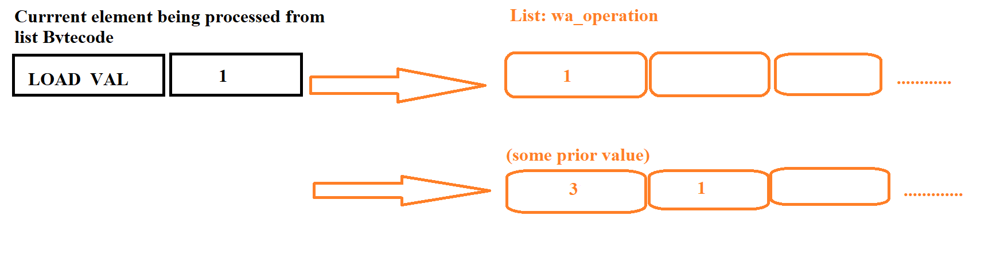
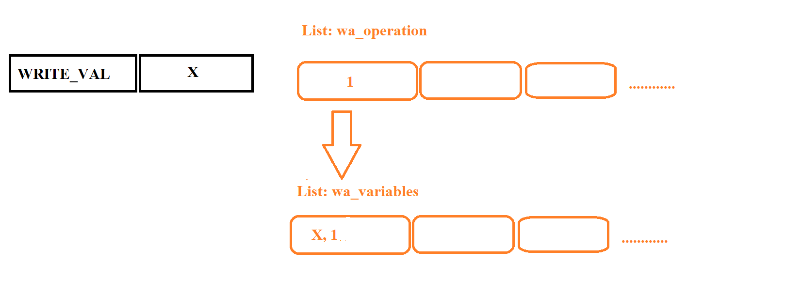
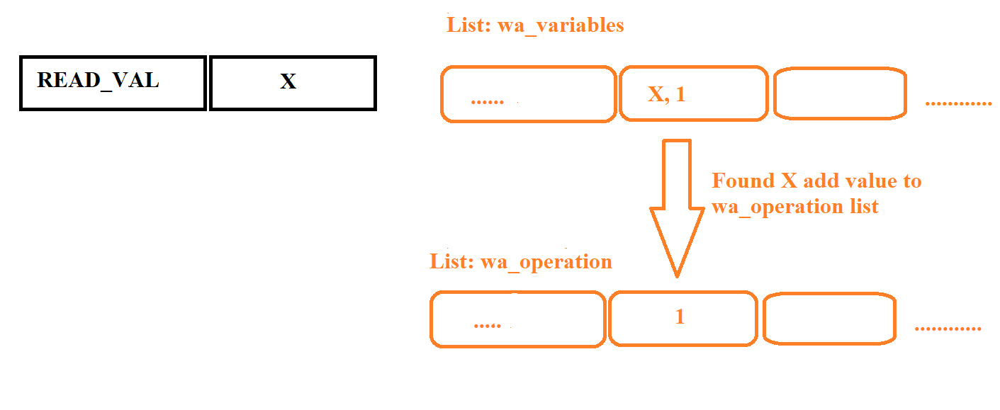
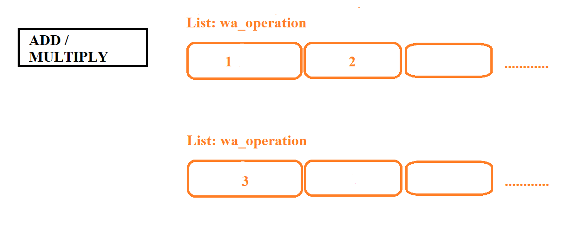
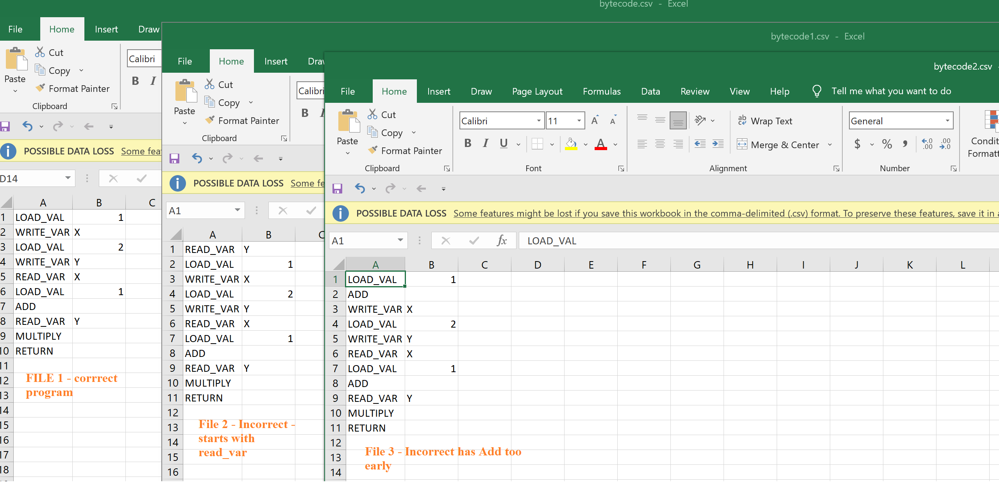
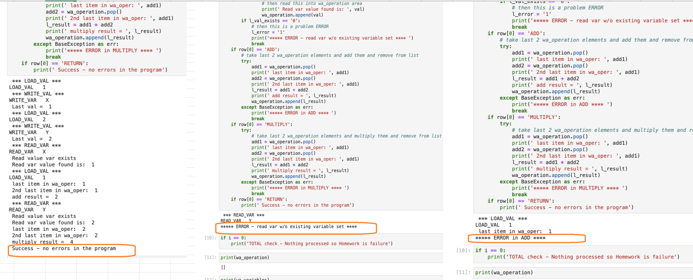

# Haskell Assignment


## Psuedo Code


### Step 1 - Read input 1 by 1 line 

Read the Bytecode from a file.


Initial file:

| Bytecode File |
| ------------- |
| LOAD_VAL 1    |
| WRITE_VAR X   |
| LOAD_VAL 2    |
| WRITE_VAR  Y  |
| READ_VAR X    |
| LOAD_VAL 1    |
| ADD           |
| READ_VAR Y    |
| MULTIPLY      |
| RETURN_VALUE  |


### Step 2  - read each element and process it.


#### Split operation and value  

We read each element in the list Bytecode and split into 2 words where applicable. also if there is 2nd word convert that to numeric.

Ex. "LOAD_VAL 1" will be split to "LOAD_VAL" and "1".

But if its just 1word it will stay the same.

Ex. ADD will remain as ADD.

then we move on to evaluate these new words formed.

Ex. "LOAD_VAL" and "1" will be passed on to next steps to evaluate


### Step 3 - Evaluate each expression


After a current element of Bytecode list is split into words we evaluate the 1st word to know what expression this is. 

This is passed from Step 2.

#### Step 3a - LOAD_VAL

if 1st word == "LOAD_VAL", 

then place the actual value into a temporary Operation work area which will be a list. This list will be called wa_operation. The every first time it could be empty but later on it could have an already loaded value from a prior Load_val.

below is illustrated when its empty or already has a value 3 as an example.





#### Step 3b - Evaluate - WRITE_VAL


Read the 1st word of the current elment we are traversing in list Bytecode and 

if == "Write_val"

Then take the last element in list wa_operation and write this to another list element which will have a Name and Value component.

if NO element is found in wa_operation then it is an ERROR. 

Also after a "WRITE_VAL" is successful complete clear the wa_operation list. 




#### Step 3c - Evaluate READ_VAL


Read the 1st word:

if == "READ_VAL"

Then take the 2nd word following READ_VAL and search for this in list wa_variables Name component and pick up its value and write this to wa_operation.

if NO element is found in wa_variables to read then it is an ERROR. 





#### Step 3d - Evaluate ADD or MULTIPLY

Read the 1st word (will not have a 2nd word):

if == "ADD" or "MULTIPLY"

Then read last 2 elements from list wa_operation and apply the addition or multiplication. (there could be more than 2 which is ok- we read only last 2)

If we do not find 2 elements from the list wa_operation then record an ERROR.

Also once Add/Multiply is done remove the 2 elements read from wa_operation and replace it with result.




#### Step 3e - Evaluate RETURN_VALUE

If we reached till here without an error then the Bytecode is pass.


## Student programs evaluated 

3 student Bytecode program examples




## Results 

Python program was use to evaluate.

### Python program file: mlabs.ipynb 

was run in Jupyter Lab no the 3 files of which the 1st was was correct and rest 2 bytecode programs were not correct.





## Haskell Practice programs

Below are some Haskell practice programs i have done in the folder - 

https://github.com/rchak007/haskell_assignment/tree/main/Haskell%20Programs


5-functions.hs

6-SocketsPlugs.hs

7-outputAndOtherThings.hs

8_if_1.hs

9-8-right-binding.hs

9-9-shopping-list.hs

9-16-final-shopping-list.hs

10-4-final-movie-list.hs

monads1.hs


### Unit 5. Functions

Haskell code: 5-functions.hs

#### Lambda

A lambda, you read, is an inline function definition. 

#### Regular Function Definition (currying)


#### Functions that Return Functions

```haskell
(\_ -> lambdaCoin) :: Bool -> (Bool -> Bool)
```


#### logical or operator


#### Unit 6. Sockets and Plugs

##### Reusability

##### Functions are Values

Functions are also themselves values, but they are a special kind of mapping-value from values to other values.

##### infix/Prefix

A function is called an **infix** function when it appears between its arguments. Normal functions are called **prefix** because they are placed before their argument(s).

##### Operator Sections

another identical function, but using what’s called a section.


##### commutative property


#### Unit 7 - Output and Other things

##### Type variables

`(+) :: Num a => a -> a -> a`

Type Variables can be named anything

##### Typeclasses

A typeclass is not a concrete type like Integer, Int or String. 

###### Num

Num typeclass means there actually isn’t only one definition for the functions for addition: 

(+), subtraction: (-), multiplication: (*), negation: negate, etc but rather that each type — that is, 
   each instance of Num — has its own definition for each of these functions

###### show

typeclass called Show (with a big S), and this provides a single function: 
   -- show (with a small s), that can take any instance of Show, and makes a String version of it.
-- takes a "showable" thing
-- and returns a String
-- show :: Show a => a -> String


#### UNIT 8 - Make Decisions

(==) operator

##### Nesting if Expressions


##### Case Expressions

##### Guard Patterns


##### Argument Pattern Matching


#### Unit 9 - Lists


##### The (:) Operator


##### List Syntax

##### List Type

##### Lists of Other Types

##### Lists with More Items


##### Polymorphic Values and Types

##### The (:) Operator Again, Binding & Associativity


###### Right / Left Binding/Associativity

###### List is Right Binding/Associativity

###### Functions are left-associative


###### type of the `(:)` operator:

```haskell
(:) :: a -> [a] -> [a]
```

